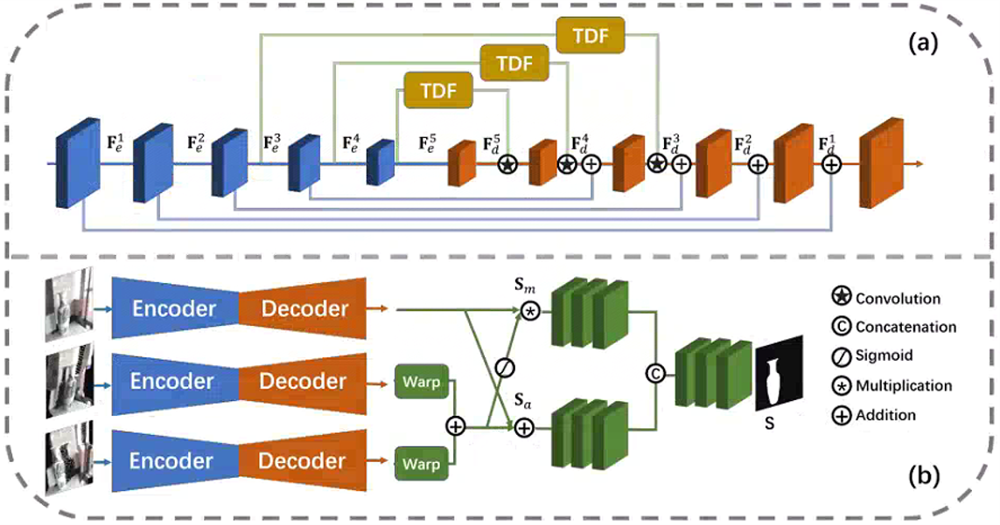

# MVSalNet
(ECCV2022)MVSalNet:Multi-View Augmentation for RGB-D Salient Object Detection
Jiayuan Zhou1, Lijun Wang1, Huchuan Lu1,2, Kaining Huang3, Xinchu Shi3 , Bocong Liu3
1 Dalian University of Technology
2 Peng Cheng Laboratory
3 Meituan

The code of MVSalNet in ECCV2022

[Results(password:yydz)](https://pan.baidu.com/s/1ZwWBvH0GhRxdsT02CMvGqg) 

## Motivations

The depth map and RGB images are from two different modalities with significant cross-modal gap.

The 3D geometry contained in depth map can be used to render the input image under different views.

## Our Contributions

We present a new framework for RGB-D SOD with multi-view augmentation, which can effectively leverage the geometry information carried in input depth maps.

We design a multi-view saliency prediction network with dynamic filtering modules, which can not only enhance saliency prediction in each single view, but also enables cross-view prediction fusion, yielding more accurate SOD results.

## Multi-View Data Augmentation

Reconstruct the 3D point cloud based on the input scene depth.

Project the point cloud to a specific target view to render the RGB image.

## Multi-View Saliency Detection Network

Single-view saliency prediction module

Multi-view fusion module

## Visual Comparisons

## Brief Summary
A new RGB-D salient object detection (SOD) framework to take full advantages of 3D geometry information contained in depth maps.
A multi-view salient detection network (MVSalNet).
Experiments on six popular benchmarks verify the effectiveness.

